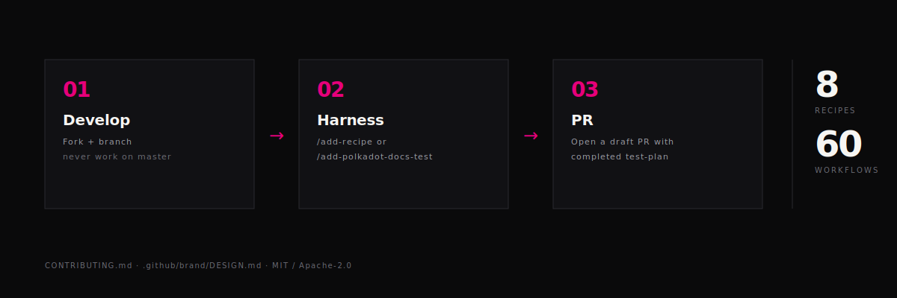

<!-- Hero generated by /branding — do not hand-edit .github/media/contributing-hero-*.svg -->
<picture>
  <source media="(prefers-color-scheme: dark)" srcset=".github/media/contributing-hero-dark.svg">
  <source media="(prefers-color-scheme: light)" srcset=".github/media/contributing-hero-light.svg">
  
</picture>

# Contributing to Polkadot Cookbook

> **Key concept:** Recipe source code lives in **your own GitHub repository**, not in this cookbook. The cookbook's `recipes/` directory contains only **test harnesses** that clone, build, and verify your external repo. A cookbook contribution = adding a test harness that points to your repo.

<picture>
  <source media="(prefers-color-scheme: dark)" srcset=".github/media/divider-dark.svg">
  <source media="(prefers-color-scheme: light)" srcset=".github/media/divider-light.svg">
  
</picture>

## Quick Start

### 1. Install the CLI

**macOS / Linux:**

```bash
curl -fsSL https://raw.githubusercontent.com/polkadot-developers/polkadot-cookbook/master/install.sh | bash
```

**Or download pre-built binaries:**

```bash
# Linux (x86_64)
curl -L https://github.com/polkadot-developers/polkadot-cookbook/releases/latest/download/dot-linux-amd64.tar.gz | tar xz
sudo mv dot /usr/local/bin/

# macOS (Apple Silicon)
curl -L https://github.com/polkadot-developers/polkadot-cookbook/releases/latest/download/dot-macos-apple-silicon.tar.gz | tar xz
sudo mv dot /usr/local/bin/
```

### 2. Create and Develop Your Recipe

Use `dot create` to scaffold a standalone project for local development:

```bash
dot create
```

Develop and test your recipe in this project. The code lives in **your own repository**, not inside the cookbook.

### 3. Push to Your Own Repository

Push your project to your own GitHub repository and tag a release:

```bash
cd my-recipe
git remote add origin https://github.com/YOUR_USERNAME/recipe-my-recipe.git
git push -u origin main
git tag v1.0.0
git push --tags
```

### 4. Add a Test Harness to the Cookbook

Fork the cookbook and create a test harness directory under `recipes/{pathway}/{your-recipe}/`:

```
recipes/{pathway}/{your-recipe}/
├── package.json           # vitest + @types/node + typescript
├── package-lock.json      # Locked dependencies
├── vitest.config.ts       # Vitest config
├── tsconfig.json          # TypeScript config
├── .gitignore             # Ignore cloned repo dir, node_modules
├── README.md              # Description + link to external repo
└── tests/
    └── recipe.test.ts     # Clone → install → build → test
```

Use an existing recipe as a template (e.g., [`recipes/contracts/contracts-example/`](recipes/contracts/contracts-example/)).

### 5. Test Locally

```bash
cd recipes/{pathway}/{your-recipe}
npm ci
npm test
```

This will clone your external repo, install its dependencies, build, and run its tests.

### 6. Open a Pull Request

Push your fork and open a PR against the cookbook repository.

<picture>
  <source media="(prefers-color-scheme: dark)" srcset=".github/media/divider-dark.svg">
  <source media="(prefers-color-scheme: light)" srcset=".github/media/divider-light.svg">
  
</picture>

## Other Ways to Contribute

### Report Bugs

Found an issue? [Open an issue](https://github.com/polkadot-developers/polkadot-cookbook/issues/new) with:
- Steps to reproduce
- Expected vs actual behavior
- Environment details

### Suggest Enhancements

Have an idea? [Open an issue](https://github.com/polkadot-developers/polkadot-cookbook/issues/new) describing:
- The enhancement
- Use case and benefits
- Examples if applicable

### Improve Documentation

Documentation fixes are welcome! Submit changes via pull request.

<picture>
  <source media="(prefers-color-scheme: dark)" srcset=".github/media/divider-dark.svg">
  <source media="(prefers-color-scheme: light)" srcset=".github/media/divider-light.svg">
  
</picture>

## CLI Commands Reference

```bash
# Project creation
dot create          # Create project (interactive)
dot create --title "My Project" --pathway pallets --non-interactive

# Shortcut commands
dot contract        # Create a contract project
dot parachain       # Create a parachain project

# Testing
dot test            # Test current directory project
dot test <path>     # Test specific project
dot test --rust     # Run only Rust tests
dot test --ts       # Run only TypeScript tests
```

> **Note:** `dot create` scaffolds a standalone project for local development. The resulting project lives in your own repository, not inside the cookbook.

<picture>
  <source media="(prefers-color-scheme: dark)" srcset=".github/media/divider-dark.svg">
  <source media="(prefers-color-scheme: light)" srcset=".github/media/divider-light.svg">
  
</picture>

## Recipe Guidelines

### Title Naming

Use clear, descriptive titles:
- ✅ "NFT Pallet with Minting and Transfers"
- ✅ "Asset Transfer using XCM"
- ❌ "My NFT Pallet" (no personal pronouns)
- ❌ "Simple Counter" (no vague qualifiers)

### Code Quality

- Test all functionality
- Follow language conventions (run `cargo fmt`, `cargo clippy`)
- Add clear comments for complex logic
- Include error handling
- **Commit lock files** (Cargo.lock and/or package-lock.json) to ensure reproducible builds
- **Pin a version tag** in the test harness (e.g., `v1.0.0`) so builds are reproducible
- **Include `package-lock.json`** in the test harness directory

### Commit Messages

Follow [Conventional Commits](https://www.conventionalcommits.org/):

```
feat(recipe): add my-recipe
fix(recipe): correct storage operations in my-recipe
docs: update CONTRIBUTING.md
test(my-recipe): add integration tests
```

<picture>
  <source media="(prefers-color-scheme: dark)" srcset=".github/media/divider-dark.svg">
  <source media="(prefers-color-scheme: light)" srcset=".github/media/divider-light.svg">
  
</picture>

## Additional Resources

### Documentation

- **[Documentation Hub](docs/README.md)** - Complete documentation organized by role
- **[Getting Started Guide](docs/getting-started/)** - Installation and first project tutorial
- **[Contributor Guide](docs/contributors/)** - Workflow, guidelines, and best practices
- **[CLI Reference](docs/developers/cli-reference.md)** - Complete CLI command reference
- **[SDK Guide](docs/developers/sdk-guide.md)** - Using the SDK programmatically

### External Resources

- **[Polkadot SDK Docs](https://paritytech.github.io/polkadot-sdk/master/polkadot_sdk_docs/index.html)** - Official Polkadot SDK documentation
- **[Polkadot Wiki](https://wiki.polkadot.network/)** - Comprehensive Polkadot network guide

<picture>
  <source media="(prefers-color-scheme: dark)" srcset=".github/media/divider-dark.svg">
  <source media="(prefers-color-scheme: light)" srcset=".github/media/divider-light.svg">
  
</picture>

## Getting Help

- **Questions**: [Open an issue](https://github.com/polkadot-developers/polkadot-cookbook/issues)
- **Example Test Harnesses**: See `recipes/` directory for test harness examples (each one clones and verifies an external recipe repo)

<picture>
  <source media="(prefers-color-scheme: dark)" srcset=".github/media/divider-dark.svg">
  <source media="(prefers-color-scheme: light)" srcset=".github/media/divider-light.svg">
  
</picture>

<div align="center">


<br/>

Thank you for contributing to Polkadot Cookbook!

[Back to Top](#contributing-to-polkadot-cookbook) • [README](README.md) • [Issues](https://github.com/polkadot-developers/polkadot-cookbook/issues)

</div>

## Brand system (visual contributions)

If you're adding or editing a user-facing visual surface (README hero, divider, social preview, pathway banner, issue templates, etc.):

1. **Read first:** [`.github/brand/DESIGN.md`](.github/brand/DESIGN.md) and [`.github/brand/tokens.yml`](.github/brand/tokens.yml).
2. **Palette discipline:** no hex codes outside `tokens.yml`. `brand-lint.yml` CI catches drift and will fail your PR.
3. **Don't hand-edit generated assets.** Files under `.github/media/` come from `/branding` templates. Edit the template; re-run `bash .claude/skills/branding/generate.sh`; commit the regenerated outputs.
4. **Voice:** [`.github/brand/voice.md`](.github/brand/voice.md) — terse, monospace-friendly, fact-bound.
5. **Token changes:** bump [`.github/brand/CHANGELOG.md`](.github/brand/CHANGELOG.md) in the same commit.
