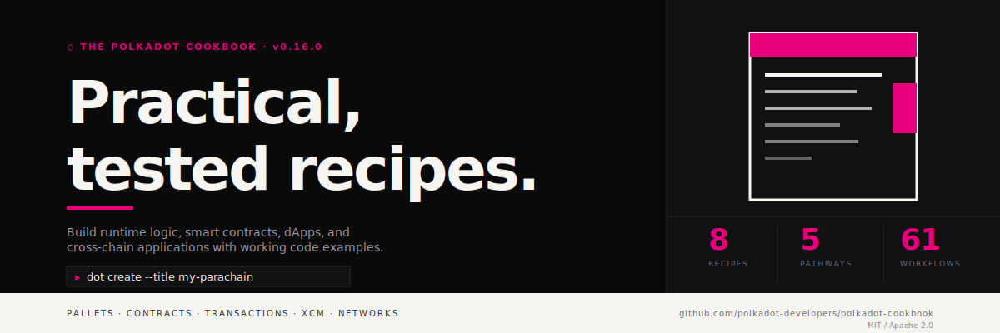

<!-- Hero is generated by /branding from .github/brand/tokens.yml — do not hand-edit .github/media/hero-*.svg -->
<div align="center">

<picture>
  <source media="(prefers-color-scheme: dark)" srcset=".github/media/hero-dark.svg">
  <source media="(prefers-color-scheme: light)" srcset=".github/media/hero-light.svg">
  
</picture>

[](LICENSE)
[](https://github.com/polkadot-developers/polkadot-cookbook/actions/workflows/test-sdk.yml)
[](dot/cli/)

[**Browse Recipes**](#recipes) · [**Contribute a Recipe**](CONTRIBUTING.md) · [**Documentation**](#documentation)

</div>

<br/>

<picture>
  <source media="(prefers-color-scheme: dark)" srcset=".github/media/divider-dark.svg">
  <source media="(prefers-color-scheme: light)" srcset=".github/media/divider-light.svg">
  
</picture>

<a id="recipes"></a>

##  Recipes

The Polkadot Cookbook provides recipes across 5 pathways of Polkadot development:

> **How it works:** Each recipe's source code lives in its own **external GitHub repository**. The `recipes/` directory here contains **test harnesses** that automatically clone, build, and verify each recipe.

###  Pallets

Build custom parachains with FRAME pallets, runtime logic, and PAPI integration testing.

> [**parachain-example**](recipes/parachains/parachain-example) — Full parachain with 12+ pallets, custom logic, and TypeScript tests
>
> [**pallet-example**](recipes/pallets/pallet-example) — Pallet-only development (no runtime) for advanced users

###  Contracts

Deploy and interact with Solidity smart contracts on Polkadot parachains.

> [**contracts-example**](recipes/contracts/contracts-example) — Solidity contracts with Hardhat and deployment scripts

###  Transactions

Single-chain transaction submission and state queries using the Polkadot API.

> [**transaction-example**](recipes/transactions/transaction-example) — Chain interactions with Polkadot API (TypeScript)

###  XCM

Cross-chain asset transfers and messaging between parachains.

> [**cross-chain-transaction-example**](recipes/cross-chain-transactions/cross-chain-transaction-example) — XCM messaging with Chopsticks local testing

###  Networks

Testing infrastructure with Zombienet and Chopsticks for local network development.

> [**network-example**](recipes/networks/network-example) — Zombienet and Chopsticks network configurations

>  **Want to share your knowledge?** See [Contributing a Recipe](CONTRIBUTING.md)

<picture>
  <source media="(prefers-color-scheme: dark)" srcset=".github/media/divider-dark.svg">
  <source media="(prefers-color-scheme: light)" srcset=".github/media/divider-light.svg">
  
</picture>

<a id="quick-start"></a>

##  Quick Start

### Run a Recipe

Each recipe directory under `recipes/` is a **test harness** that clones and verifies an external repository. To run any recipe:

```bash
cd recipes/{pathway}/{recipe-name}
npm ci          # Install test harness dependencies
npm test        # Clone external repo → install → build → test
```

For example:
```bash
cd recipes/contracts/contracts-example
npm ci && npm test
```

The test harness automatically:
1. Clones the recipe's external GitHub repository at a pinned version
2. Installs the recipe's dependencies
3. Builds the project
4. Runs the recipe's test suite

> **Tip:** Check each recipe's README.md for a link to the source repository and details on what the test verifies.

### Contribute a Recipe

Contributing a recipe is a two-part process: develop your recipe in your own repository, then add a test harness to the cookbook.

#### 1. Develop Your Recipe

Use the `dot` CLI to scaffold a new project locally:

```bash
# Install the CLI
curl -fsSL https://raw.githubusercontent.com/polkadot-developers/polkadot-cookbook/master/install.sh | bash

# Create a new project (interactive mode)
dot create
```

<a id="advanced-installation"></a>
<details>
<summary><b>Advanced Installation Options</b></summary>

<br/>

**Manual download (all platforms):**

Download pre-built binaries from [GitHub Releases](https://github.com/polkadot-developers/polkadot-cookbook/releases/latest):

```bash
# Linux (x86_64)
curl -L https://github.com/polkadot-developers/polkadot-cookbook/releases/latest/download/dot-linux-amd64.tar.gz | tar xz
sudo mv dot /usr/local/bin/

# macOS (Apple Silicon)
curl -L https://github.com/polkadot-developers/polkadot-cookbook/releases/latest/download/dot-macos-apple-silicon.tar.gz | tar xz
sudo mv dot /usr/local/bin/

# macOS (Intel)
curl -L https://github.com/polkadot-developers/polkadot-cookbook/releases/latest/download/dot-macos-intel.tar.gz | tar xz
sudo mv dot /usr/local/bin/

# Windows
# Download dot-windows-amd64.exe.zip from releases, extract, and add to PATH
```

**Build from source:**

Requires [Rust](https://rustup.rs/) installed.

```bash
git clone https://github.com/polkadot-developers/polkadot-cookbook.git
cd polkadot-cookbook
cargo build --release --bin dot
# Binary will be at ./target/release/dot (or dot.exe on Windows)
```

</details>

Develop and test your project, then push it to your own GitHub repository and tag a release (e.g., `v1.0.0`).

#### 2. Add a Test Harness

Fork the cookbook and add a test harness under `recipes/{pathway}/{your-recipe}/` that clones, builds, and tests your external repo. See [recipes/contracts/contracts-example/](recipes/contracts/contracts-example/) for a complete example.

#### 3. Open a PR

Run your test harness locally (`npm ci && npm test`), then open a pull request.

See [CONTRIBUTING.md](CONTRIBUTING.md) for the complete guide.

<picture>
  <source media="(prefers-color-scheme: dark)" srcset=".github/media/divider-dark.svg">
  <source media="(prefers-color-scheme: light)" srcset=".github/media/divider-light.svg">
  
</picture>

<a id="documentation"></a>

##  Documentation

### For Recipe Contributors
- [Contributing Guide](CONTRIBUTING.md) - How to create and submit recipes
- [CLI Tool](dot/cli/) - Command-line tool for creating projects

### For Developers
- [SDK Library](dot/sdk/) - Programmatic API for tool developers

### For Maintainers
- **Template Integration Tests** - Validate that `dot create` templates generate correctly:
  ```bash
  cargo test --package cli --test pathway_integration_tests -- --ignored
  ```
  These tests verify the CLI's project scaffolding, not the recipe test harnesses.
- Integration tests run automatically on:
  - Releases
  - Weekly schedule
  - PRs touching `rust-toolchain.toml` or templates

<picture>
  <source media="(prefers-color-scheme: dark)" srcset=".github/media/divider-dark.svg">
  <source media="(prefers-color-scheme: light)" srcset=".github/media/divider-light.svg">
  
</picture>

<a id="contributing"></a>

##  Contributing

We welcome all contributions:

- ** Recipe** - Share your Polkadot knowledge (most welcome!)
- ** Bug Report** - Help us improve
- ** Feature** - Suggest tooling improvements
- ** Documentation** - Make things clearer

See [CONTRIBUTING.md](CONTRIBUTING.md) to get started.

<picture>
  <source media="(prefers-color-scheme: dark)" srcset=".github/media/divider-dark.svg">
  <source media="(prefers-color-scheme: light)" srcset=".github/media/divider-light.svg">
  
</picture>

<a id="license"></a>

##  License

MIT OR Apache-2.0

<picture>
  <source media="(prefers-color-scheme: dark)" srcset=".github/media/divider-dark.svg">
  <source media="(prefers-color-scheme: light)" srcset=".github/media/divider-light.svg">
  
</picture>

<div align="center">


<br/>

Built by [Polkadot Developers](https://github.com/polkadot-developers)

[Recipes](#recipes) • [Contributing](CONTRIBUTING.md) • [Issues](https://github.com/polkadot-developers/polkadot-cookbook/issues)

</div>
