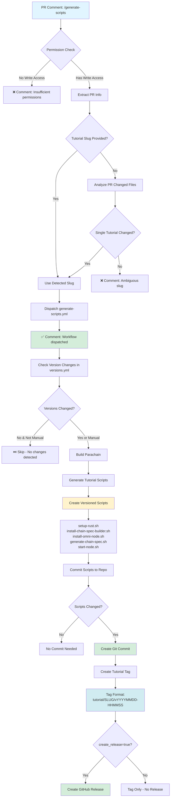
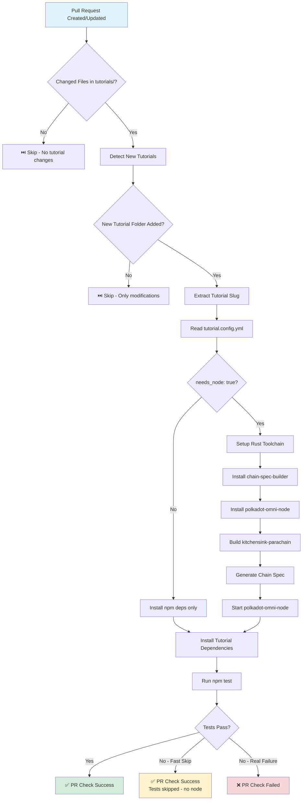
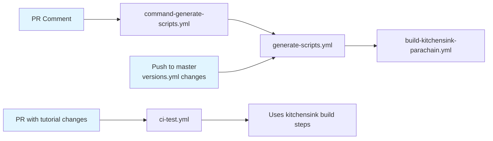

# GitHub Workflows Documentation

This document describes the automated workflows used in the Polkadot Cookbook repository.

## Overview

The repository uses four main GitHub Actions workflows:

1. **command-generate-scripts.yml** - PR comment command handler
2. **generate-scripts.yml** - Script generation and release workflow
3. **ci-test.yml** - PR tutorial testing
4. **build-kitchensink-parachain.yml** - Parachain build workflow

## Workflow Diagrams

### Script Generation Flow



### PR Testing Flow



## Workflow Details

### 1. command-generate-scripts.yml

**Trigger**: PR comment containing `/generate-scripts` or `/generate-release`

**Purpose**: Allows maintainers to trigger script generation for a tutorial via PR comments

**How it works**:

1. **Permission Check**: Verifies the comment author has write access to the repository
2. **Command Parsing**: Extracts command and optional parameters:
   - `slug=<tutorial-slug>` - Specify which tutorial
   - `key=<tutorial-key>` - versions.yml key (default: zero_to_hero)
   - `force=1` - Force generation even if no version changes
3. **Slug Detection**: If no slug provided, analyzes PR changed files to detect the tutorial
4. **Workflow Dispatch**: Triggers `generate-scripts.yml` with the resolved parameters
5. **Acknowledgment**: Posts a comment confirming the dispatch

**Usage Examples**:

```bash
# Auto-detect tutorial from PR changes
/generate-scripts

# Specify tutorial explicitly
/generate-scripts slug=my-tutorial

# Force generation regardless of version changes
/generate-scripts slug=my-tutorial force=1

# Generate and create a GitHub release
/generate-release slug=my-tutorial

# Override versions.yml key
/generate-scripts slug=my-tutorial key=my_custom_key
```

**Key Differences**:

- `/generate-scripts` - Creates tag only
- `/generate-release` - Creates tag AND GitHub release

### 2. generate-scripts.yml

**Triggers**:
- Workflow dispatch (manual or from command-generate-scripts.yml)
- Push to master/dev with changes to `versions.yml`

**Purpose**: Generates tutorial-specific scripts with pinned versions and optionally creates releases

**Inputs**:
- `tutorial_key` (default: zero_to_hero) - Key in versions.yml
- `tutorial_slug` (default: zero-to-hero) - Tutorial folder name
- `create_release` (default: false) - Whether to create GitHub release
- `force_generation` (default: false) - Force generation without version check

**How it works**:

1. **Version Change Detection**:
   - Reads `versions.yml` for the specified tutorial_key
   - Compares with previous commit to detect changes in:
     - `rust` version
     - `chain_spec_builder` version
     - `polkadot_omni_node` version
   - Skips if no changes (unless forced or manual trigger)

2. **Parachain Build** (if versions changed):
   - Uses `build-kitchensink-parachain.yml` workflow
   - Builds with resolved Rust version
   - Caches build artifacts

3. **Script Generation**:
   - Creates `tutorials/<slug>/scripts/` directory
   - Generates pinned setup scripts:
     ```bash
     setup-rust.sh                       # Rust version setup
     install-chain-spec-builder.sh       # Tool installation
     install-omni-node.sh                # Tool installation
     generate-chain-spec.sh              # Chain spec creation
     start-node.sh                       # Node startup
     ```
   - All scripts use exact versions from `versions.yml`

4. **Commit & Push**:
   - Commits generated scripts to the repository
   - Only commits if scripts changed
   - Uses `github-actions[bot]` as committer

5. **Tagging**:
   - Creates tutorial-specific tag: `tutorial/<slug>/vYYYYMMDD-HHMMSS`
   - If tag exists, appends short commit SHA: `tutorial/<slug>/vYYYYMMDD-HHMMSS-abc1234`
   - Tag message includes all resolved versions

6. **Release** (optional):
   - If `create_release=true`, creates GitHub release with tag
   - Release body includes commit SHA and all tool versions

**Outputs**:
- `rust-version` - Resolved Rust version
- `chain-spec-builder-version` - Resolved chain-spec-builder version
- `omni-node-version` - Resolved omni-node version
- `scripts-committed` - Whether scripts were committed
- `commit-sha` - Commit SHA of the script commit
- `tutorial-slug` - Tutorial slug processed

### 3. ci-test.yml

**Trigger**: Pull request with changes to `tutorials/**` (excluding `scripts/`)

**Purpose**: Runs tests for newly added tutorials

**How it works**:

1. **Find Changed Tutorials**:
   - Compares PR base and head commits
   - Identifies NEWLY ADDED tutorial folders (not modifications)
   - Returns list of tutorial slugs to test

2. **Read Tutorial Requirements**:
   - Reads `tutorial.config.yml` for each tutorial
   - Checks `needs_node` field to determine if node setup is required

3. **Setup Environment** (if `needs_node: true`):
   - Installs Rust toolchain (from `versions.yml`)
   - Installs chain-spec-builder (from `versions.yml`)
   - Installs polkadot-omni-node (from `versions.yml`)
   - Builds kitchensink-parachain runtime
   - Generates chain specification
   - Starts polkadot-omni-node in background

4. **Run Tests**:
   - Installs tutorial npm dependencies
   - Runs `npm run test --silent`
   - Tests should implement fast-skip pattern if no node available

5. **Pass Criteria**:
   - Tests pass
   - OR tests skip gracefully (fast-skip pattern)

**Strategy**: Matrix strategy - runs tests for each detected tutorial in parallel

### 4. build-kitchensink-parachain.yml

**Trigger**: Called by `generate-scripts.yml` as a reusable workflow

**Purpose**: Build the kitchensink parachain runtime with specific Rust version

**Inputs**:
- `tutorial_key` - versions.yml key to read Rust version from

**How it works**:

1. Reads Rust version from `versions.yml` for the specified tutorial
2. Sets up Rust toolchain with that version
3. Adds wasm32-unknown-unknown target
4. Builds kitchensink-parachain with `cargo build --release`
5. Uses Swatinem/rust-cache for faster subsequent builds

**Outputs**: Compiled WASM runtime in `target/release/wbuild/`

## Workflow Relationships



## Version Management

The `versions.yml` file at the repository root defines tool versions:

```yaml
versions:
  rust: "1.86.0"
  chain_spec_builder: "0.20.0"
  polkadot_omni_node: "0.4.1"

# Tutorial-specific overrides (optional)
zero_to_hero:
  rust: "1.86.0"
  chain_spec_builder: "0.20.0"
  polkadot_omni_node: "0.4.1"
```

Workflows resolve versions with this priority:
1. Tutorial-specific version (`<tutorial_key>.<tool>`)
2. Global version (`versions.<tool>`)

## Best Practices

### For Contributors

1. **Don't manually run workflows** - They're triggered automatically or via PR comments
2. **Use fast-skip pattern in tests** - Always check for node availability
3. **Keep tutorial.config.yml accurate** - CI relies on this metadata
4. **Test locally first** - Use `npm test` before pushing

### For Maintainers

1. **Use /generate-scripts after merge** - Generates production scripts with pinned versions
2. **Update versions.yml carefully** - Changes trigger script regeneration
3. **Create releases for major updates** - Use `/generate-release` for significant changes
4. **Monitor workflow runs** - Check Actions tab for failures
